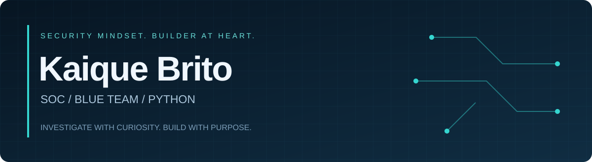

  

  <b>Ciência da Computação · Segurança defensiva · Automação</b> 
  Curiosidade para investigar. Código para simplificar.

  <a href="https://github.com/antibonvivant/cybersecurity-portfolio"><b>Explorar meu portfólio →</b></a>

---

### Olá, eu sou o Kaique.

Sou estudante de Ciência da Computação e desenvolvo soluções com **Python, automação e APIs REST**. Meu foco de carreira é **SOC / Blue Team e Security Operations**: entender o que aconteceu, investigar o contexto e comunicar os próximos passos com clareza.

Estou organizando meu trabalho em segurança em um portfólio público, com roteiros de investigação, ferramentas de apoio e espaço para evidências reproduzíveis.

### O que você encontra por aqui

| Frente | Conteúdo |
| :--- | :--- |
| **Segurança defensiva** | Roteiros de triagem, análise de logs e documentação de incidentes |
| **Código & automação** | Python, APIs REST e ferramentas de apoio à investigação |
| **Documentação técnica** | Contexto, hipóteses, evidências, limitações e recomendações |

### Laboratório de investigações

| Projeto | Pergunta central | Status |
| :--- | :--- | :--- |
| [**01 · Windows Authentication**](https://github.com/antibonvivant/cybersecurity-portfolio/tree/main/projects/01-windows-authentication) | O que uma sequência de falhas de autenticação realmente indica? | Planejado · execução pendente |
| [**02 · Phishing Investigation**](https://github.com/antibonvivant/cybersecurity-portfolio/tree/main/projects/02-phishing) | Quais evidências sustentam a classificação de um e-mail? | Planejado · execução pendente |
| [**03 · Network Traffic**](https://github.com/antibonvivant/cybersecurity-portfolio/tree/main/projects/03-network-traffic) | O que DNS, HTTP e TCP revelam sobre uma comunicação? | Planejado · execução pendente |

Os casos serão publicados como concluídos após a execução e o registro das evidências. Os roteiros e scripts já disponíveis são materiais de preparação.

### Meu foco agora

**Windows e logs de autenticação · SIEM/Wazuh · Wireshark · análise de phishing · resposta a incidentes**

Estou concentrando meus estudos e projetos nesses temas, conectando segurança à minha base de desenvolvimento.

> Uma boa investigação deixa claro o que sabemos, o que ainda é hipótese e qual evidência falta.

### Vamos conversar?

Busco oportunidades de **nível júnior em SOC, Blue Team e operações de TI**, incluindo NOC, IAM, infraestrutura e suporte cloud. Meu portfólio reúne o que estou preparando e a evolução das investigações.

  <a href="https://github.com/antibonvivant/cybersecurity-portfolio">Portfólio de segurança</a> · <a href="https://github.com/antibonvivant?tab=repositories">Repositórios</a>

